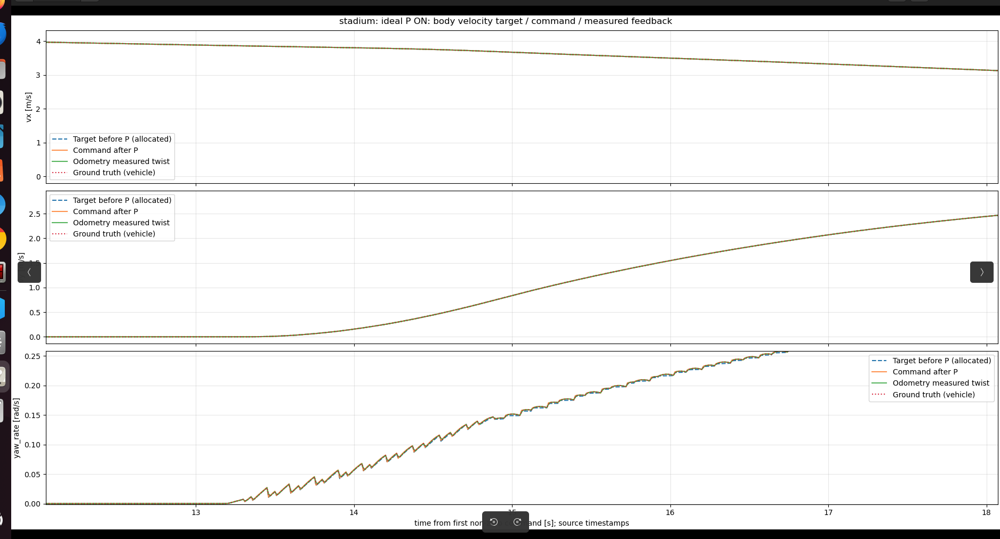
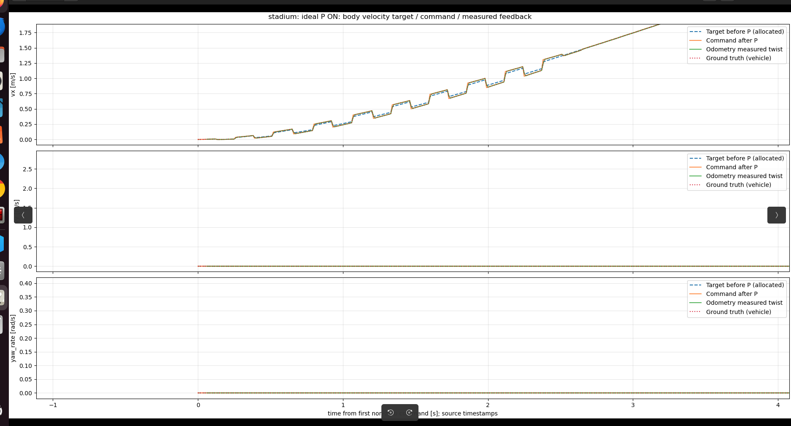
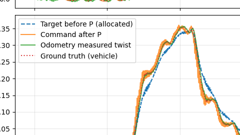

# 시뮬레이션 명령의 톱니·계단 현상: 증상, 원인, 수정 과제

작성일: 2026-09-11

상태: **진단 및 후속 작업 기록. 이 문서 작성 시 제어·플래닝 코드는 수정하지 않음.**

## 1. 요약

ideal 실행에서도 보정 전 목표부터 yaw-rate에 반복적인 톱니가, 초기 vx에 반복적인 계단이 관찰됐다. 차량이 목표를 못 따라가는 문제와 **목표 명령 자체가 매끄럽지 않은 문제**를 구분해야 한다.

| 문제 | 확인한 사실 | 아직 해결해야 할 부분 |
|---|---|---|
| A. 같은 계획 내부의 yaw-rate 톱니 | 연속적으로 계산하는 `vκ`에서 구간별 고정 `β̇`를 빼므로 구간 경계에서 회전 명령이 튄다. 로그에서도 확인했다. | allocation 결과와 실행 샘플링의 연속성·미분 관계를 일관되게 설계하고 검증 |
| B. 계획 교체 시 vx 및 yaw-rate 점프 | `plan_id`가 바뀌는 시점에 보정 전 명령부터 점프한다. 교체가 반복돼 계단도 반복된다. | 새 계획 시작 상태가 이전 계획과 연결되지 않는 근본 원인 규명 및 수정 |

**A의 직접적인 발생 메커니즘은 확인했다. B는 전환 시점의 불연속을 확인한 것이며, 시작 상태 계산이 왜 어긋나는지는 아직 확정하지 않았다.** 재계획 자체가 불연속을 필연적으로 만드는 것은 아니다.

## 2. 그래프와 실험 해석

속도 비교 그래프의 각 선은 다음을 뜻한다.

- `Target before P (allocated)`: allocation 이후, P 보정 이전의 목표 명령. 원래 전역 경로 자체가 아니다.
- `Command after P`: P 보정을 더해 차량에 보낸 명령.
- `Odometry measured twist`: `/odom`의 측정 속도·각속도.
- `Ground truth (vehicle)`: `/ground_truth/odom`의 실제 모델 속도·각속도.

ideal 모델은 명령 속도를 실제 속도로 바로 사용한다. 따라서 명령이 꺾이면 실제값과 측정값도 함께 꺾일 수 있다. **ideal은 센서·응답 모델의 불확실성을 제거한 조건이지, 목표 명령의 매끄러움을 보장하는 조건이 아니다.**

P 보정 전부터 존재하는 꺾임을 센서 노이즈 또는 P 게인만의 문제로 해석하지 않는다. 다만 P 보정이 명령 차이를 추가로 키우거나 줄일 수 있고, noisy에서는 피드백이 재계획에도 영향을 준다.

## 3. 근거 로그

이전 진단에서 대조한 실행:

```text
/home/sum/Desktop/simp_planner/simp_planner_debug/stadium/compare_20260911_163226/
  raw/ideal/stadium/20260911_163227/command_history.csv
```

아래 시각은 첫 non-zero 명령의 source timestamp를 기준으로 한 경과 시간이며 반올림한 값이다. CSV의 `pre_p_*` 열은 현재 가산형 P 보정량을 발행 명령에서 빼서 복원한 값이다.

단위 주의: 해당 CSV의 `yaw_rate`, `pre_p_yaw_rate`는 rad/s이지만, `beta_rate` 등 일부 기존 각도 진단 열은 deg/s다. 아래 β̇ 수치는 rad/s로 변환한 값이다. 분석 시 열 이름만 보고 단위를 가정하지 않는다.

### A. 같은 계획 내부의 yaw-rate 하강



사용자가 공유한 확대 화면 원본(`Screenshot from 2026-09-11 16-48-55.png`). 하단 yaw-rate에서 반복적인 톱니·계단이 보인다. 아래 로그 대조는 이 중 구간 경계와 계획 교체 사건을 구분한 것이다.

13.46초: `plan_id = 95` 유지, `interval_index = 0 → 1`.

| 값 | 직전 | 직후 | 단위 |
|---|---:|---:|---|
| 보정 전 속도로 계산한 `vκ` | 0.04019 | 0.04257 | rad/s |
| β̇ | 0.01315 | 0.03184 | rad/s |
| 보정 전 yaw-rate `vκ − β̇` | 0.02704 | 0.01073 | rad/s |

`vκ`는 조금 증가했지만 빼주는 β̇가 더 크게 증가해 yaw-rate가 급감했다. **이 사건은 새 계획 교체 없이 발생했다.**

13.51초에는 계획 `95 → 96` 전환과 함께 보정 전 yaw-rate가 약 `0.02022 → 0.01371 rad/s`로 감소했다. 따라서 같은 그래프에 내부 구간 경계와 계획 교체 영향이 섞여 있다.

### B. 반복적인 계획 교체와 vx 계단



사용자가 공유한 확대 화면 원본(`Screenshot from 2026-09-11 16-49-05.png`). 상단 vx에서 목표와 실행 명령이 반복적으로 위아래로 뛰는 현상을 확인할 수 있다.

| 경과 시간 | 계획 교체 | 보정 전 vx의 인접 샘플 변화 |
|---|---|---:|
| 1.60초 | 13 → 14 | 약 +0.100 m/s |
| 1.73초 | 14 → 15 | 약 −0.089 m/s |
| 1.86초 | 15 → 16 | 약 +0.106 m/s |
| 1.99초 | 16 → 17 | 약 −0.093 m/s |

1.60초의 보정 전 vx는 약 `0.608 → 0.708 m/s`, 보정 후 vx는 약 `0.586 → 0.741 m/s`였다. 이 구간에서는 약 0.13초 간격으로 계획이 바뀌므로 한 번이 아니라 반복적인 계단이 나타났다. 이 간격을 모든 실행에 고정된 재계획 주기로 일반화하지 않는다.

### C. 최초 질문의 부분 확대 이미지



사용자가 공유한 부분 화면 원본(`Screenshot from 2026-09-11 16-38-50.png`). 제목과 시간축이 잘려 있으므로 이 이미지 단독으로 ideal/noisy 조건이나 사건 시각을 확정하지 않는다. 선의 의미와 질문 당시 관찰 모습을 보존하기 위한 참고 자료다.

위 세 이미지는 `/home/sum/Pictures/Screenshots/`의 원본을 편집 없이 저장소의 `docs/assets/command_continuity/`에 복사했다. 문서에는 상대 경로로 연결했으므로 문서와 이미지 폴더를 함께 보관한다.

## 4. 문제 A: allocation 결과를 실행 명령으로 바꾸는 방식

관련 파일:

- [core.cpp](simp_planner/simp_planner_cpp/src/core.cpp): `allocate_trajectory()`
- [runtime.cpp](simp_planner/simp_planner_cpp/src/runtime.cpp): `sample_body_command()`

현재 allocation은 각 궤적 구간에서 대략 다음 관계로 값을 저장한다.

```text
beta_rate[k] = motion_heading_rate[k] - allocated_yaw_rate[k]
beta[k+1] = beta[k] + beta_rate[k] * dt
```

실행 시에는 다음과 같이 명령을 재구성한다.

```text
beta_rate = allocation.beta_rate[interval]       # 구간 내 고정
beta = allocation.beta[interval] + beta_rate * tau
kappa = 인접 곡률 사이의 선형 보간
motion_heading_rate = speed * kappa             # 구간 내 변화
yaw_rate = motion_heading_rate - beta_rate
```

계획 구간 기본 간격은 0.1초이고 실행 기본 간격은 0.01초다. 실제 간격은 설정 및 로그로 확인한다. 커브 진입처럼 `vκ`와 β̇가 증가하는 구간에서는 다음 패턴이 반복될 수 있다.

1. 구간 안에서 β̇는 고정된 채 `vκ`가 증가해 yaw-rate가 상승한다.
2. 다음 구간에서 β̇가 새 값으로 뛰면 yaw-rate가 갑자기 하강한다.
3. 이후 구간에서도 같은 방식으로 계산되어 톱니가 반복된다.

allocation에 yaw-rate·각가속도·jerk 제한이 있어도, 이산 계산점의 제한만으로 **재구성된 연속시간 명령의 경계 연속성**까지 보장되지는 않는다. 저장된 `allocation.yaw_rate`를 그대로 부드럽게 연결해 실행하는 구조도 아니다.

allocation OFF에서는 β̇를 0으로 설정하므로 이 β̇ 단차 원인은 제외된다. 그러나 계획 교체나 다른 샘플링 문제까지 모두 사라진다는 뜻은 아니다. 브랜치 이름으로 ON/OFF를 판단하지 말고 실행 파라미터를 확인한다.

### 수정 방향 — 설계 후보이며 아직 구현·검증하지 않음

- [ ] β와 β̇를 구간 사이에서 일관되게 연결하는 연속시간 표현을 정한다.
- [ ] 예: 양 끝 β·β̇ 조건을 사용하는 Hermite 보간을 검토하되, 기존 β̇가 구간값인지 노드 미분값인지부터 명확히 한다. 배열에 단순 보간만 추가해도 해결된다고 가정하지 않는다.
- [ ] 동일한 표현에서 β와 그 미분 β̇를 구하고, `vx = v cosβ`, `vy = v sinβ`, `yaw_rate = χ̇ − β̇`를 함께 계산한다.
- [ ] χ·χ̇도 일관성을 점검한다. 현재 χ의 각도 보간과 `χ̇ = vκ` 계산이 서로 정확한 미분 관계인지 확인한다.
- [ ] β 범위, β̇, β̈, yaw-rate, yaw 가속도·jerk 제한을 구간 내부와 경계 모두에서 검사한다. 보간은 오버슈트나 추가 가속도를 만들 수 있다.
- [ ] 변경된 실행 궤적이 기존 allocation 및 충돌 검사에서 평가한 궤적과 일치하는지 검증한다.

**yaw-rate만 필터링하거나 보간하고 β·vx·vy는 그대로 두는 처방은 피한다.** 이동 방향과 차체 방향 사이의 운동학적 관계가 어긋날 수 있다. 가속도·jerk 연속성까지 필요하면 β·β̇의 연속성만으로는 부족하므로 더 높은 차수의 연결 또는 allocation 재설계도 검토한다.

## 5. 문제 B: 새 계획 시작 상태와 실행 중 계획의 연결

관련 파일:

- [runtime.cpp](simp_planner/simp_planner_cpp/src/runtime.cpp): `predict_handover_state()`, `sample_body_command()`
- [planner_node.cpp](simp_planner/simp_planner_cpp/src/planner_node.cpp): `planning_callback()`, `activate_pending_locked()`, 명령 실행 및 P 적용 부분

현재도 기존 계획과 odometry를 사용해 미래 교체 시점 상태를 예측하는 코드가 있다. 따라서 단순히 “연결 기능이 없다”고 결론 내리지 않는다.

### 원인 규명을 위해 확인할 사항

- [ ] 새 계획을 만들 때 예측에 사용한 `plan_id`와 실제 교체 직전 실행한 `plan_id`가 같은가?
- [ ] 계획의 예정 시작 시각, 실제 활성화 시각, odometry 시각, 샘플링 경과 시간이 일관되는가?
- [ ] pending/active 계획 전환과 계획 생성 콜백의 순서에 따라 이전 계획을 잘못 참조하는 경우가 있는가? **현재는 가설이며 미확인이다.**
- [ ] handover가 예측한 속도·가속도가 새 계획의 첫 상태에 그대로 들어가는가? 이후 계획 생성이나 allocation 단계에서 바뀌는가?
- [ ] 이전 계획의 보정 전 명령과 P 보정 후 실행 명령 중 무엇을 연결 기준으로 사용하는가? 위치·속도·헤딩 기준이 서로 섞이지 않는가?

진단할 때는 **동일한 교체 시각**에서 이전 계획을 샘플링한 값, handover 예측값, 새 계획 시작값, 새 계획의 첫 실행값을 비교한다. 서로 다른 시각의 인접 로그 차이는 정상 가속에 의한 변화도 포함하므로 그것만으로 연결 오차의 정확한 크기를 정의하지 않는다.

### 수정 목표

근본 원인을 확인한 뒤 정상 재계획에서 목표 속도·방향·회전 명령이 교체 시각에 이어지도록 한다. 필요한 가속도 연속성도 함께 정의한다. 목표 pose를 측정 pose로 다시 맞추는 정책과 시간 궤적을 이어가는 정책은 별도의 설계 선택이므로, 점프를 감추기 위해 목표를 임의로 재설정하지 않는다.

긴급 정지·모드 전환처럼 의도적으로 동작을 바꾸는 사건은 정상 재계획과 분리해서 검사한다. 연결을 수정하려고 기존 안전 정지 동작을 약화시키지 않는다.

## 6. 수정 및 검증 순서

1. 원본 로그와 실제 실행 파라미터를 보존하고 경계 사건을 재현하는 테스트를 먼저 만든다.
2. 문제 A의 구간 내·구간 간 연속성 수정 및 단위 테스트를 수행한다.
3. 문제 B의 handover 단계별 값을 추적해 원인을 확정하고 수정한다.
4. ideal에서 확인한 뒤 noisy에서도 재검증한다. 수정 전후 비교 중에는 P 게인·노이즈 설정을 바꾸지 않는다.

### 완료 판단 기준

- [ ] 같은 계획의 각 경계 `t_k − ε`, `t_k`, `t_k + ε`에서 보정 전 vx·vy·yaw-rate를 검사한다. 정상 구간에서 ε를 줄여도 남는 유한한 점프가 없어야 한다.
- [ ] 계획 교체 시에는 이전/새 계획을 동일 시각 기준으로 비교하고, 연결 오차의 허용 수치를 테스트에 명시한다.
- [ ] 자세·속도·미분 관계 및 차량 제한을 만족한다. 그래프가 매끈해졌다는 사실만으로 통과시키지 않는다.
- [ ] P OFF로 보정 전 불연속을 분리 확인하고, P ON에서는 보정량과 최종 명령까지 확인한다. OFF/ON 실행의 목표가 서로 같다고 가정하지 않는다.
- [ ] allocation ON/OFF에서 각각 검사하고 정지·저속·모드 전환 회귀 테스트를 수행한다.
- [ ] 목표 대비 실제 위치·헤딩 오차, 충돌 검사 결과가 악화되지 않았는지 확인한다.

최소 진단 그래프는 기존 속도 비교 그래프에 계획 교체 시점과 내부 구간 경계를 구분해 보는 것이다. yaw-rate 원인 분해에는 `vκ`, β̇, `vκ − β̇`, P 보정량을 같은 시간축에서 비교하면 된다. **이 추가 진단 표시와 위 수정 항목은 모두 후속 작업이며, 이 문서 작성으로 구현된 것은 아니다.**
