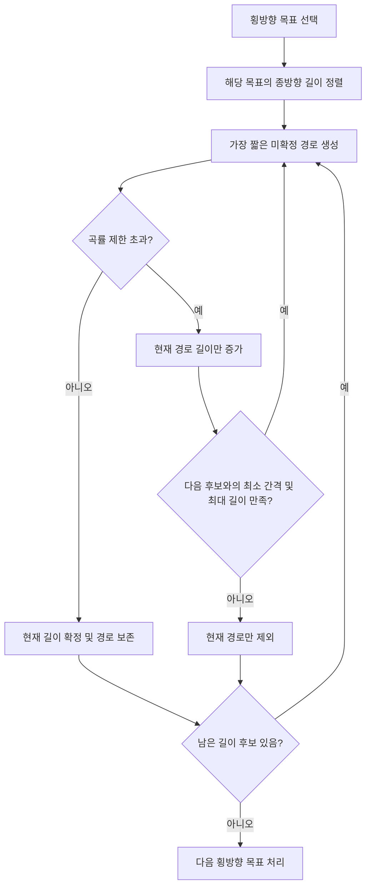
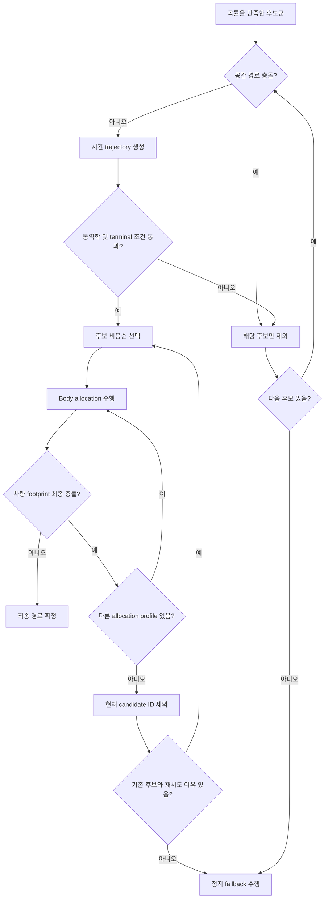

# 곡률 초과 경로의 개별 재생성 방안

## 1. 기존 방식

- 횡방향 목표와 여러 종방향 transition 길이를 조합해 전체 경로 후보군을 생성한다.
- 생성된 경로 중 한 점이라도 곡률 제한을 초과하면 전체 후보군을 다시 생성한다.
- 정상 경로까지 반복 생성되므로 계산량이 증가하고, 후보 ID와 평가 순서도 흔들릴 수 있다.

## 2. 변경 목표

- 곡률을 초과한 경로만 종방향 transition 길이를 늘려 다시 생성한다.
- 이미 곡률 조건을 만족한 경로는 유지한다.
- 같은 횡방향 목표에 속한 경로들의 종방향 길이는 항상 짧은 순서를 유지하며 서로 중복되지 않게 한다.

## 3. 같은 횡방향 목표의 종방향 길이 진행 규칙

189개 후보는 각각 독립적으로 유지한다. 같은 횡방향 목표의 후보들은 최초 종방향 길이를 기준으로 서로 침범할 수 없는 길이 구간을 갖는다.

1. 최초 계획 길이를 오름차순으로 정렬한다.
2. 현재 경로의 곡률이 초과되면 현재 경로만 길이를 늘려 재생성한다.
3. 길이는 같은 횡목표의 다음 후보 길이에서 최소 간격을 뺀 값까지만 늘릴 수 있다.
4. 허용 구간 안에서 곡률을 만족하면 재생성된 길이를 확정한다.
5. 다음 후보와 겹치기 전까지 곡률을 만족하지 못하면 현재 후보만 제외한다.
6. 다음 후보를 포함한 나머지 정상 후보의 길이와 경로는 변경하지 않는다.

즉, 같은 횡방향 목표에서는 다음 관계를 항상 유지한다.

```text
L1_final < L2_final < L3_final
각 길이 차이 >= 최소 길이 간격
```

## 4. 변경 플로우



## 5. 곡률 확정 후 충돌 처리

곡률을 만족한 후보만 충돌 검사로 넘긴다. 충돌은 경로 길이 증가 사유로 사용하지 않고, 해당 후보의 통과 또는 제외 기준으로만 사용한다.

### 5.1 공간 경로 충돌

- 각 후보의 preview 구간을 costmap과 검사한다.
- 충돌한 후보만 제외하고, 같은 횡목표의 다른 종방향 길이 후보는 유지한다.
- 충돌하지 않은 후보는 clearance와 경로 비용을 계산해 다음 단계로 넘긴다.

### 5.2 시간 trajectory 유효성

- 공간 검사를 통과한 후보에 속도와 시간을 입혀 trajectory를 생성한다.
- 동역학 제한 또는 terminal 조건을 통과하지 못하면 해당 후보만 제외한다.
- 나머지 후보 중 비용이 낮은 후보를 계속 평가한다.

### 5.3 차량 형상 기준 최종 충돌

- 선택 후보에 body allocation을 적용한 뒤 차량 footprint로 최종 충돌을 검사한다.
- 가능한 allocation profile을 순서대로 검사하고, 하나라도 안전하면 최종 경로로 확정한다.
- 모든 allocation profile이 충돌하면 현재 candidate ID만 제외하고, 이미 생성된 나머지 후보에서 다시 선택한다.
- 같은 횡목표의 서로 다른 길이 후보까지 모두 실패했을 때만 해당 횡목표를 제외한다.
- 재선택은 후보가 소진되거나 allocation 재시도 상한에 도달할 때까지 수행한다.



## 6. 후보가 모두 실패한 경우

1. 장애물 전 정지거리가 확보되면 충돌 지점 앞에서 끝나는 short-path stop을 생성한다.
2. short-path stop도 불가능하면 현재 횡위치를 유지하는 비상 감속 경로를 검사한다.
3. allocation 재시도 상한에 먼저 도달하면 강제 안전정지로 전환한다.
4. 안전한 정지 경로도 없으면 안전 경로 없음으로 처리하고 다음 planning cycle에서 다시 시도한다.

## 7. 적용 시 핵심 주의사항

- 길이 보정과 중복 제거는 같은 횡방향 목표 그룹 안에서만 수행한다.
- 재생성해도 해당 경로의 후보 ID와 길이 순번은 유지한다.
- 초과 경로의 길이 상한은 `다음 후보 길이 - 최소 간격`으로 제한한다.
- 같은 횡목표의 마지막 길이 후보는 전체 최대 길이를 상한으로 사용한다.
- 길이 상한 또는 최대 길이에 도달해도 곡률을 만족하지 못한 경로만 무효 처리한다.
- 초과하지 않은 나머지 후보는 길이 보정이나 재생성을 하지 않는다.
- 충돌 검사와 비용 평가는 각 경로의 최종 길이가 확정된 뒤 수행한다.
- 곡률 초과와 장애물 충돌을 구분한다. 곡률 초과는 길이 증가 대상이고, 충돌은 후보 제외 대상이다.
- 동일 planning snapshot 안에서는 확정된 후보군을 재사용해 189개 전체를 다시 생성하지 않는다.
- 차량 상태, 기준 경로 또는 costmap이 변경된 다음 planning cycle에서는 이전 충돌 결과를 그대로 재사용하지 않는다.

## 8. 기대 결과

- 곡률 초과 경로만 재계산하여 전체 경로 생성 비용을 줄인다.
- 동일 횡목표 내 종방향 길이 후보의 중복과 순서 역전을 방지한다.
- 충돌한 후보만 단계적으로 제외하고 정상 후보군을 재사용한다.
- 정상 후보와 후보 ID가 유지되어 이후 screening 및 선택 결과가 안정적이 된다.
