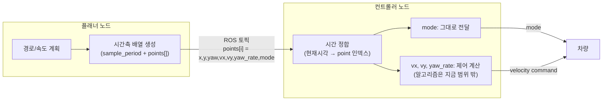

# 플래너 / 컨트롤러 노드 분리 계획

## 범위
- **포함**: 노드 분리(플래너 프로세스 ↔ 컨트롤러 프로세스), 플래너의 출력 형식(시간축 배열), 컨트롤러의 100Hz 커맨드 발행과 시간 정합.
- **제외 (지금은)**: 실제 제어 알고리즘(추종 제어기 자체). 노드 분리 구조부터 정리하고, 제어기는 나중에.
- **`feature/tracking_trajectory` 브랜치**: 구조(TrackingTrajectory 메시지, 100Hz, 시간 정합 방식)는 참고하되, 검증 없이 그대로 채용하지 않음 — 잠재적 문제가 안 잡힌 코드로 간주.
- **지금 단계**: 코드 수정 없음. 내용 정리만 하고, 수정 지시가 있을 때 진행.

## 노드 구성
- **플래너 노드**: 기존처럼 경로/속도 계획을 수행. 출력은 **시간축 기준 배열** — header + sample_period(고정 시간간격) + points[]. 각 point는 궤적 위 한 점으로, 위치/속도(x,y,yaw,vx,vy,yaw_rate)와 **모드**를 같이 담음.
- **컨트롤러 노드**: 별도 프로세스로 분리. 플래너가 보낸 배열을 받아서 **시간 정합**(현재 시각 vs 배열의 시작 시각 + sample_period로 어느 point를 써야 할지 계산)을 거쳐 100Hz로 커맨드를 발행.
- **모드 처리**: point마다 들어있는 모드값은 컨트롤러가 재해석/재계산하지 않고 **그대로 차량에 전달**. (반면 속도 커맨드 쪽은 실제 제어 알고리즘을 거치는지 여부가 아직 범위 밖 — "제외" 항목 참고.)
- **모드 조회 방식 (결정됨): ZOH(Zero-Order Hold)**. 모드는 연속값이 아니라 보간이 안 되므로, 현재 시각 기준 **방금 지나온 가장 최근 point의 모드를 그대로 유지**하다가 다음 point 시각에 도달해야 전환함 (floor 방식, "다음 point 모드를 미리 당겨쓰는" ceil 방식은 채택 안 함 — 모드 전환은 차량이 실제로 바퀴 정렬을 다시 하는 물리적 이벤트라 미래 모드를 앞당겨 쓰면 안 전해서).
  - 예: point가 1s=forward, 2s=crab이면 → 1.5s는 forward, 2.1s는 crab.

## 블록도

## 핵심 요구사항: 중간 전환(플랜 폐기, 저크스탑 등)도 배열에 미리 포함
지금 구조에는 계획을 수행하던 도중에 현재 궤적을 버리고 다른 동작(예: jerk-limited 긴급정지)으로 전환하는 경우가 있음. 이런 전환이 "나중에 새 메시지가 따로 날아와서 끊기는" 방식이면 안 되고, **처음 보내는 한 배열 안에 그 전환 시퀀스까지 이미 포함되어 있어야 함.**

예시 느낌 (아래 "확인 필요" 참고): 정규주행 → 정지(감속 구간, 여러 point에 걸쳐 진행) → 스팟턴, 이런 식으로 여러 phase/모드 전환이 하나의 배열 안에 순서대로 이미 들어있는 구조.

## 확인 필요
아래 두 문장은 제가 100% 확신하지 못해서 제 해석을 적어둡니다. 맞는지 확인 부탁드립니다.

1. "현재 active/pending 관련해서, 중간에 궤적 계획을 버리고 진행하는 경우가 있었는데 저크스탑이나" → **제 해석**: 지금 플래너가 진행 중이던 계획을 중도에 폐기하고 jerk-limited 정지(`JerkLimitedSafetyStop`) 같은 걸로 전환하는 경우가 실제로 있고, 이런 전환 이벤트도 컨트롤러에 보내는 배열 안에 미리 반영되어 있어야 한다는 뜻으로 이해했습니다.
2. "정규 정지 정지 정지 스팟턴은 계획계획 이러한 느낌으로" → **제 해석**: 배열 하나가 "정규주행 point들 → 정지(감속) point들 → 스팟턴 point들"처럼 여러 모드/phase가 순서대로 섞여 들어간 형태라는 뜻으로 이해했습니다. 정확한 의도 확인 부탁드립니다.
