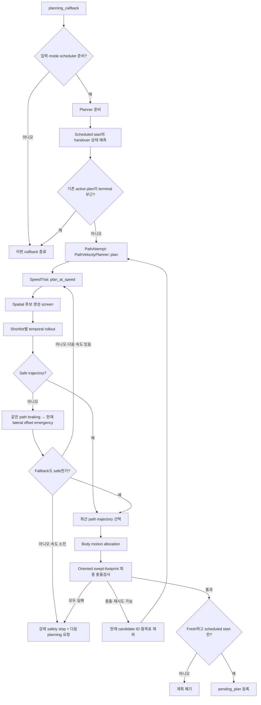

# 현재 Planning 알고리즘 플로우

> 현재 C++ production 코드 `d62fc76` 기준.
> 초기 planning과 이후 planning은 같은 흐름을 사용한다. Allocation 충돌 시에만
> 같은 planning cycle 안에서 실패 path를 제외하고 다시 planning한다.

## 1. 한눈에 보는 전체 흐름



```text
입력 확인 → 미래 handover 예측 → 속도/공간/시간 계획
→ body allocation → 최종 footprint 충돌검사
→ 통과 시 pending 등록, 충돌 시 해당 path 제외 후 재계획
```

## 2. 실제 실행 순서

### 1) 입력과 scheduler 확인

`planning_callback()`은 odometry, reference path, costmap, 목표 속도, 요청/실제
vehicle mode를 확인한다. Mode 불일치, 아직 시작하지 않은 pending plan, planning 주기·
coalescing 조건 때문에 준비되지 않았으면 이번 callback을 끝낸다.

- `planner_node.cpp:572-600`
- scheduler: `runtime.cpp:374-400`

### 2) Planner 준비

Path·구조 설정·drive mode revision이 달라진 경우 `PathVelocityPlanner`를 재생성한다.
가능하면 이전 maneuver 연속성, lateral hint, feasible speed cap을 승계한다.

- `planner_node.cpp:528-555`

### 3) Handover 상태 예측

새 plan의 `scheduled_start`를 정한 뒤, active plan을 그 시각까지 적분해 미래 위치,
운동 상태, allocator 초기 상태를 예측한다. 기존 trajectory가 먼저 끝나면
jerk-limited safety stop을 이어서 예측한다.

- 호출: `planner_node.cpp:603-620`
- 구현: `runtime.cpp:196-270`

Terminal 목표 ±0.20 m 이내이고 예측 속도가 0.25 m/s 이하이면 새 planning 없이 기존
active plan의 종료를 기다린다.

### 4) PathAttempt와 SpeedTrial

`PathVelocityPlanner::plan()` 1회가 하나의 **PathAttempt**다.

- 정지 명령이며 현재도 정지 상태: `STATIONARY_COMMAND_HOLD`
- 그 외: `speed_trials()`가 요청 속도 또는 기억된 feasible speed cap에서 시작해
  감속 후보를 생성
- 각 속도마다 `plan_at_speed()` 실행, 첫 feasible 결과에서 종료

기본 SpeedTrial 상한은 PathAttempt당 3회다.

- `core.cpp:2008-2042`, `core.cpp:2606-2682`

### 5) Frenet·terminal 조건 계산

`plan_at_speed()`는 현재 상태를 reference path에 투영한 뒤 preview 길이, terminal까지
남은 거리, stopping distance, terminal 제약과 terminal safe-region 활성 여부를 계산한다.

- `core.cpp:2076-2168`

### 6) Spatial 후보 생성

기본 횡목표 `n_target` 65개(-8~+8 m, 0.25 m 간격)와 transition 길이 조합마다
`generate_spatial_path_candidate()`를 실행한다.

각 후보는 Frenet 경계조건 → lateral profile → `(x,y,heading)` → curvature/rate → 비용
순으로 생성된다. Curvature 초과 시 transition 길이를 늘려 최대 depth 8까지 재생성한다.
이전 allocation 충돌로 제외된 candidate ID 또는 횡목표는 제거한다.

- 생성 함수: `core.cpp:462-687`
- 후보 loop: `core.cpp:2185-2251`

### 7) Spatial screen

`screen_spatial_candidate()`가 curvature, coarse hard collision, clearance/장애물 비용,
bottleneck horizon, terminal goal 영역을 검사한다. Terminal goal 영역은 terminal
safe-region이 활성일 때 hard 통과 조건에 포함된다. 통과 후보만 temporal 단계로 간다.

통과 후보가 없으면 장애물 전 가용 길이가 정지에 충분한 path들을 짧게 잘라
`short-path stop` 후보로 다시 검사한다.

- screen: `core.cpp:1248-1347`
- short-path fallback: `core.cpp:2281-2319`

### 8) Temporal rollout과 선택

Spatial 후보를 비용순으로 정렬하고 shortlist batch마다
`generate_open_loop_trajectory()`를 실행한다.

- 기본 horizon 4.0초
- trajectory knot 0.1초
- 동역학 검증 substep 0.01초
- 검사: 속도, 가속도, jerk, heading/lateral 동역학, curvature, terminal 정지

한 batch에서 safe trajectory가 나오면 뒤 batch는 평가하지 않는다.

- 정렬·batch: `core.cpp:2321-2420`
- rollout: `core.cpp:1441-1824`
- safe: `valid_dynamic && collision_free && terminal_valid()`

### 9) Temporal fallback

Nominal safe trajectory가 없으면 다음 순서로 시도한다.

1. 평가된 최선 spatial path에서 jerk-limited braking
2. 실패하면 현재 Frenet lateral offset을 유지하는 `emergency_stop()`

Fallback도 `safe()`를 만족해야 feasible이다. 선택 결과는 allocator 입력용
`PlannerMotionTrajectory`로 변환된다.

- `core.cpp:2422-2603`

### 10) Body allocation과 최종 충돌검사

Feasible motion을 body yaw, slip angle `beta`, `vx/vy`, yaw rate/acceleration으로 할당한다.
현재 profile 순서는 `LATERAL_PRIORITY → MINIMUM_VY`이며, Left/Right crab mode는
`LATERAL_PRIORITY`만 사용한다.

각 allocation은 knot 사이를 translation/yaw 변화량에 맞춰 세분화한 뒤, 모든 pose에서
oriented multi-circle footprint로 costmap을 검사한다. 이것이 최종 hard collision gate다.

- allocation: `core.cpp:2693-2848`
- final collision: `core.cpp:2895-2957`
- profile search: `core.cpp:2960-3003`

### 11) Allocation 충돌 시 PathReplan

모든 allocation profile이 충돌하면 현재 selected candidate ID와 `n_target`을 누적 제외하고
`PathVelocityPlanner::plan()`을 다시 호출한다. 동일한 handover 상태·command를 사용하며
기본 최대 16회 반복한다.

- `planner_node.cpp:652-692`

### 12) 최종 결과 처리

- 안전 결과 없음: pending plan 제거, 강제 jerk-limited safety stop,
  `NO_SAFE_PLAN_RETRY` 요청
- 계산 중 hard input 변경: `STALE_PLAN_DISCARDED`
- scheduled start보다 늦음: `LATE_PLAN_DISCARDED` 후 재요청
- 안전·fresh·제시간: `ExecutablePlan`을 `pending_plan_`에 원자적으로 등록
- 예외: `PLANNING_RETRY` 요청

Pending plan은 scheduled start에 active plan으로 승격되고 100 Hz로 command가 실행된다.

- 결과 처리: `planner_node.cpp:695-760`
- activation/execution: `planner_node.cpp:778-910`

## 3. 핵심 함수 호출 계층

```text
PlannerNodeCpp::planning_callback
├─ LatestOnlyPlanningScheduler::begin_if_due
├─ ensure_planner
├─ predict_handover_state
├─ PathVelocityPlanner::plan                  # PathAttempt
│  ├─ speed_trials
│  └─ PathVelocityPlanner::plan_at_speed      # SpeedTrial
│     ├─ generate_spatial_path_candidate
│     ├─ screen_spatial_candidate
│     ├─ generate_open_loop_trajectory
│     ├─ emergency_stop                       # 필요할 때만
│     └─ build_allocator_trajectory
├─ allocate_with_oriented_collision_search
│  ├─ allocate_trajectory
│  └─ check_oriented_allocation_collision
└─ pending_plan 등록 또는 safety stop
```

## 4. 반복 단위와 기본 상한

| 반복 | 현재 기본값 |
|---|---:|
| Scheduler callback | 기본 100 Hz |
| 실제 PlanningCycle 시작 | scheduler 제한 최대 10 Hz |
| PathAttempt | 최초 1회 + PathReplan |
| SpeedTrial | 최대 3회/PathAttempt |
| 횡목표 | 65개 |
| Curvature 재생성 | 최대 depth 8 |
| Temporal batch | 일반 9개/terminal 3개, 이후 4개씩 |
| Allocation profile | 최대 2개, crab은 1개 |
| PathReplan | 최대 16회 |

## 5. 종료 상태

| 상태 | 의미 |
|---|---|
| `PENDING_PLAN_READY` | 안전검사 통과 후 실행 대기 등록 완료 |
| `TERMINAL_ACTIVE_PLAN_FINISHING` | terminal 부근의 기존 plan을 계속 사용 |
| `NO_SAFE_PLAN_SAFETY_STOP` | 안전 결과 없음, 안전정지 및 재요청 |
| `STALE_PLAN_DISCARDED` | 계산 중 hard input 변경 |
| `LATE_PLAN_DISCARDED` | scheduled start를 넘겨 결과 폐기 |
| `PLANNING_FAILED` | 예외 발생, 재요청 |

## 6. 현재 코드의 중요한 해석 기준

1. Nominal temporal rollout은 정적 장애물을 다시 검사하지 않는다. Spatial screen과
   allocation 이후 oriented collision 검사가 이를 담당한다.
2. `adaptive_replan_active=false`이므로 allocation 실패 대응은 비용 가중치 변경이 아니라
   candidate ID·횡목표 누적 제외다.
3. `PENDING_PLAN_READY`는 실행 완료가 아니라 미래 실행을 위한 등록 완료다.
