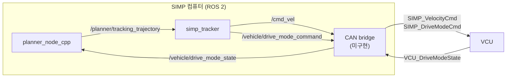
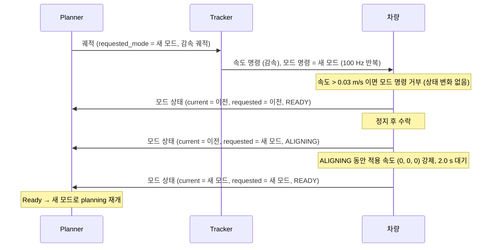

# SIMP ↔ 차량 CAN 인터페이스 입출력 정의

이 문서는 SIMP 소프트웨어와 차량(VCU)이 CAN으로 주고받는 입출력을 코드 기준으로
정의한다. DBC 초안은 같은 디렉토리의 [simp_vehicle_interface.dbc](simp_vehicle_interface.dbc)다.

- 기준 브랜치/커밋: `feature/tracking_trajectory` / `dfdc5f6` (2026-09-29)
- 차량 동작의 기준 구현: `planar_velocity_sim` (실차 VCU가 대체할 대상)
- 참고 문서: [TRACKING_TRAJECTORY_KR.md](../simp_tracker/TRACKING_TRAJECTORY_KR.md),
  [SPOT_TURN_DESIGN_KR.md](../SPOT_TURN_DESIGN_KR.md), [PARAMETERS_KR.md](../PARAMETERS_KR.md)
- 단위: SI, 각도는 rad

## 1. 범위

차량과 직접 주고받는 **3개 신호만** CAN으로 정의한다. 그 밖의 입력(odometry,
reference path, costmap 등)은 ROS 토픽으로 받으며 이 문서의 범위가 아니다.



| 방향 | ROS 토픽 | 메시지 타입 | ROS 송신 | CAN 메시지 |
|---|---|---|---|---|
| SIMP → 차량 | `/cmd_vel` | `geometry_msgs/Twist` | simp_tracker | `SIMP_VelocityCmd` |
| SIMP → 차량 | `/vehicle/drive_mode_command` | `std_msgs/UInt8` | simp_tracker | `SIMP_DriveModeCmd` |
| 차량 → SIMP | `/vehicle/drive_mode_state` | `simp_planner_msgs/DriveModeState` | 차량 | `VCU_DriveModeState` |

### 1.1 명령과 피드백 경로

명령은 **Planner → Tracker → 차량**으로 가고, 피드백은 **차량 → Planner**로 바로 온다.
Tracker는 차량 피드백을 받지 않는다.

```text
            ┌──────────── 모드 피드백 (/vehicle/drive_mode_state) ────────────┐
            ▼                                                                  │
       ┌─────────┐  궤적 31점 (10 Hz)        ┌─────────┐  /cmd_vel (100 Hz)     ┌──────┐
       │ Planner │ ────────────────────────▶ │ Tracker │ ─────────────────────▶ │ 차량 │
       │ (판단)  │  점마다 vx, vy, yaw_rate  │ (재생 + │  drive_mode_command    │      │
       └─────────┘  + requested_mode         │  보정)  │ ─────────────────────▶ │      │
                                             └─────────┘                        └──────┘
```

| 노드 | 역할 | 차량과의 관계 |
|---|---|---|
| Planner | 모드 전환·정지·스팟턴 등 모든 판단. 결과를 궤적 점(속도 + `requested_mode`)에 담아 발행 | 모드 피드백 수신만 한다. 차량에 직접 명령하지 않는다 |
| Tracker | 현재 시각의 궤적 점을 골라 위치 오차 보정 후 속도 명령 발행. 점의 `requested_mode`를 그대로 전달 | 차량에 명령하는 유일한 노드. 모드 판단을 하지 않고 `/vehicle/drive_mode_state`를 구독하지 않는다 |
| 차량 | 속도 명령 적용, 모드 명령 수락·정렬, 모드 상태 보고 | — |

- Planner는 이 브랜치에서 `/cmd_vel`, `/vehicle/drive_mode_command`를 **직접 발행하지 않는다**
  ([tracker_node.cpp:15-17](../simp_tracker/src/tracker_node.cpp#L15-L17)).
- 차량이 알려주는 완료는 **모드 전환(바퀴 정렬) 완료** 하나뿐이다. 종점 도착과 스팟턴
  회전 완료는 planner가 자기 계획(nominal 모델)으로 판정하며 차량 확인이 아니다.

CAN 설계에 주는 의미:

1. **요청과 피드백의 경로 길이가 다르다.** 모드 요청은 planner → 궤적(10 Hz) → tracker
   → 차량을 거치므로 planner 결정 후 최대 약 0.1 s 이상 늦게 차량에 닿는다. 피드백은
   차량에서 planner로 바로 온다.
2. **Planner가 멈추면 명령도 멈춘다.** 궤적 하나는 0.30 s 분량이다. 새 궤적이 없으면
   0.30 s 뒤 tracker는 모드 명령을 끊고 속도 명령은 0을 낸다. VCU 명령 timeout(§7-3)은
   이 동작을 기준으로 정한다.
3. **CAN bridge의 두 방향은 서로 다른 노드와 연결된다.** 송신은 tracker 출력, 수신은
   planner 입력이다.

## 2. 출력: SIMP → 차량

### 2.1 `/cmd_vel` — Body 속도 명령

| 필드 | 의미 | 단위 | 좌표계 | 사용 |
|---|---|---|---|---|
| `linear.x` | 종방향 속도 `vx` | m/s | body (`base_link`) | 사용 |
| `linear.y` | 횡방향 속도 `vy` (좌측 +) | m/s | body | 사용 |
| `angular.z` | yaw rate (반시계 +) | rad/s | body | 사용 |
| `linear.z`, `angular.x`, `angular.y` | — | — | — | 항상 0, 미사용 |

- **주기**: 100 Hz (tracker 독립 타이머 10 ms). 유효한 명령이 없어도 매 주기 발행한다.
- **값 결정** ([control.hpp](../simp_tracker/include/simp_tracker/control.hpp)):
  현재 시각의 궤적 점을 `ceil((now - header.stamp) / 0.01 s)`로 고르고(보간 없음),
  위치·자세 오차에 Lyapunov 피드백을 더한다.
  ```text
  vx = vx_ref·cos(eθ) − vy_ref·sin(eθ) + kx·ex
  vy = vy_ref·cos(eθ) + vx_ref·sin(eθ) + ky·ey
  r  = r_ref + kθ·eθ
  ```
- **Zero command를 내는 경우**: 궤적 없음, 빈 배열, 잘못된 주기, 시작 전, 궤적 만료,
  NaN/Inf 입력·결과, 위치 입력 없음 또는 좌표계 불일치, gain이 0 이하 또는 유한하지 않음.
- **포화·제한 없음**: tracker는 속도·가속도 제한을 걸지 않는다. 참조 속도 상한은
  planner의 진행 속도 `v_max = 5.8 m/s`, 스팟턴 `yaw_rate_max = 0.3 rad/s`이며,
  여기에 피드백 항이 더해진다.

### 2.2 `/vehicle/drive_mode_command` — 드라이브 모드 요청

| 필드 | 의미 | 범위 |
|---|---|---|
| `data` | 요청 드라이브 모드 | 0~4 (§5 모드 표) |

- **주기**: tracker 주기(100 Hz)마다, **유효한 궤적 점이 있을 때만** 발행한다.
  유효 점이 없으면 이 토픽은 나가지 않는다. 유효 점은 있지만 위치 입력·좌표계·gain
  문제로 속도가 zero일 때는 모드는 발행된다.
- **값**: 선택된 궤적 점의 `requested_mode`. 이는 planner가 궤적을 발행하던 시점의
  `DriveModeSupervisor::requested_mode()`다. SPOT_TURN(4)은 planner가 내부적으로만
  요청한다 (외부 `/requested_drive_mode`는 0~3만 허용).
- 변화가 없어도 같은 값을 반복 송신한다. 차량은 같은 값 반복을 무시해야 한다.

## 3. 입력: 차량 → SIMP

### 3.1 `/vehicle/drive_mode_state` — 드라이브 모드 피드백

| 필드 | 의미 | 범위 |
|---|---|---|
| `current_mode` | 차량이 확정한 현재 모드 | 0~4 |
| `requested_mode` | 차량이 수락해 전환 중(또는 완료)인 목표 모드 | 0~4 |
| `status` | 0 = ALIGNING (바퀴 재구성 중), 1 = READY | 0~1 |

- **주기**: 20 Hz 주기 발행 + 명령 수락 시와 전환 완료 시 즉시 발행.
- **Planner 검증**: 범위를 벗어난 값이 하나라도 있으면 메시지 전체를 버린다
  ([planner_node.cpp:881-887](../simp_planner/simp_planner_cpp/src/planner_node.cpp#L881-L887)).
- **Planner의 Ready 판정**: `planner 요청 모드 == current_mode` 이고 `status == READY`
  ([runtime.cpp:49-53](../simp_planner/simp_planner_cpp/src/runtime.cpp#L49-L53)).
  Ready가 아니면 planning을 하지 않고 정지 궤적만 낸다.
- ROS 메시지의 `header`는 planner가 쓰지 않는다. CAN bridge가 수신 시각과
  `base_link`로 채운다.

## 4. 모드 전환 절차

차량 쪽 동작은 `DriveModeTransitionModel`
([mode_transition.py](../planar_velocity_sim/planar_velocity_sim/mode_transition.py))이 기준이다.



차량 쪽 규칙:

1. 이미 그 모드로 READY이거나 같은 모드로 ALIGNING 중이면 명령을 무시한다.
2. 다른 모드로 바꾸는 명령은 차량 자체 속도 `hypot(vx, vy) ≤ 0.03 m/s`일 때만
   수락한다 (yaw rate는 검사하지 않음).
3. 수락하면 `requested_mode`를 바꾸고 `status = ALIGNING`, 전환 시간 동안 속도 0을 강제한다.
4. 전환 시간(`mode_transition_duration_sec`, 기본 2.0 s)이 지나면
   `current_mode = requested_mode`, `status = READY`.
5. 거부 사실은 별도로 알리지 않는다. 상태가 바뀌지 않는 것으로만 알 수 있다.

## 5. 드라이브 모드 값

| 값 | 이름 | 일반적인 body 속도 방향 | 외부 요청 가능 |
|---:|---|---|---|
| 0 | FORWARD | `vx > 0` | 예 |
| 1 | REVERSE | `vx < 0` | 예 |
| 2 | LEFT (crab) | `vy > 0` | 예 |
| 3 | RIGHT (crab) | `vy < 0` | 예 |
| 4 | SPOT_TURN | `vx = vy = 0`, yaw rate만 | 아니오 (planner 내부) |

## 6. CAN 매핑 (DBC 초안)

| CAN ID | 메시지 | 방향 | 대응 토픽 | 주기 |
|---|---|---|---|---|
| 0x100 | `SIMP_VelocityCmd` | SIMP → VCU | `/cmd_vel` | 10 ms |
| 0x101 | `SIMP_DriveModeCmd` | SIMP → VCU | `/vehicle/drive_mode_command` | 10 ms, 유효 점 있을 때만 |
| 0x200 | `VCU_DriveModeState` | VCU → SIMP | `/vehicle/drive_mode_state` | 50 ms + 변화 시 |

| 신호 | 비트 | 스케일 | 표현 범위 | 근거 |
|---|---|---|---|---|
| `VelCmd_Vx`, `VelCmd_Vy` | 16 signed | 0.001 m/s | ±32.767 m/s | `v_max` 5.8 m/s + 피드백 여유 |
| `VelCmd_YawRate` | 16 signed | 0.0001 rad/s | ±3.2767 rad/s | 스팟턴 0.3 rad/s + 피드백 여유 |
| 모드, 상태 | 8 unsigned | 1 | 0~4 / 0~1 | §5 |

모든 메시지는 Classic CAN 8바이트, 표준 11bit ID, Intel(little-endian)이다.

## 7. 결정이 필요한 사항

1. **CAN ID와 노드 이름**: 현재는 임시값이다. 차량 쪽 ID 체계에 맞춘다.
2. **E2E 보호 (rolling counter, checksum)**: 현재 코드에는 대응 개념이 없어 넣지 않았다.
   세 메시지 모두 빈 바이트가 있어 추가할 수 있다.
3. **명령 timeout**: 시뮬레이터는 새 명령이 없으면 마지막 명령을 유지한다.
   실차 VCU는 `SIMP_VelocityCmd`가 일정 시간(예: 3주기) 끊기면 정지해야 한다.
4. **모드 명령 송신 방식**: 지금처럼 유효 점이 있을 때만 보낼지, 항상 주기 송신하고
   "요청 없음" 값을 둘지 정한다.
5. **모드 명령 거부 통지**: 현재는 상태가 안 바뀌는 것으로만 알 수 있다. 거부 사유
   신호가 필요한지 정한다.
6. **차량 제약 반영**: tracker와 simulator 모두 속도·가속도 포화가 없다. 실제 VCU
   한계값(모드별 `vx`, `vy`, yaw rate 범위)이 정해지면 스케일과 범위를 다시 정한다.

## 8. 기존 문서와 현재 코드가 다른 부분

이 문서를 쓰며 확인한 불일치다. 이 문서는 코드를 기준으로 삼았다.

| 문서 | 문서 내용 | 현재 코드 (`dfdc5f6`) |
|---|---|---|
| PARAMETERS_KR.md §14 (기준 `7b48c30`) | Planner가 `/cmd_vel`, `/planner/cmd_vel_stamped`, `/planner/executed_command`, `/vehicle/drive_mode_command` 발행 | Planner는 발행하지 않음. `/cmd_vel`, `/vehicle/drive_mode_command`는 simp_tracker가 발행 |
| PARAMETERS_KR.md §6 | `command_frequency_hz`, `mode_command_period_sec` 파라미터 존재 | planner_node에 선언 없음 (100 Hz 명령 타이머 제거됨) |
| TRACKING_TRAJECTORY_KR.md | tracker gain 기본값 `kx=3.0, ky=4.0, ktheta=2.0` | `tracker_node.cpp`가 `0.3, 0.2, 0.2`로 선언하고 launch에서 덮어쓰지 않음. 실제 적용값은 `0.3, 0.2, 0.2` |
